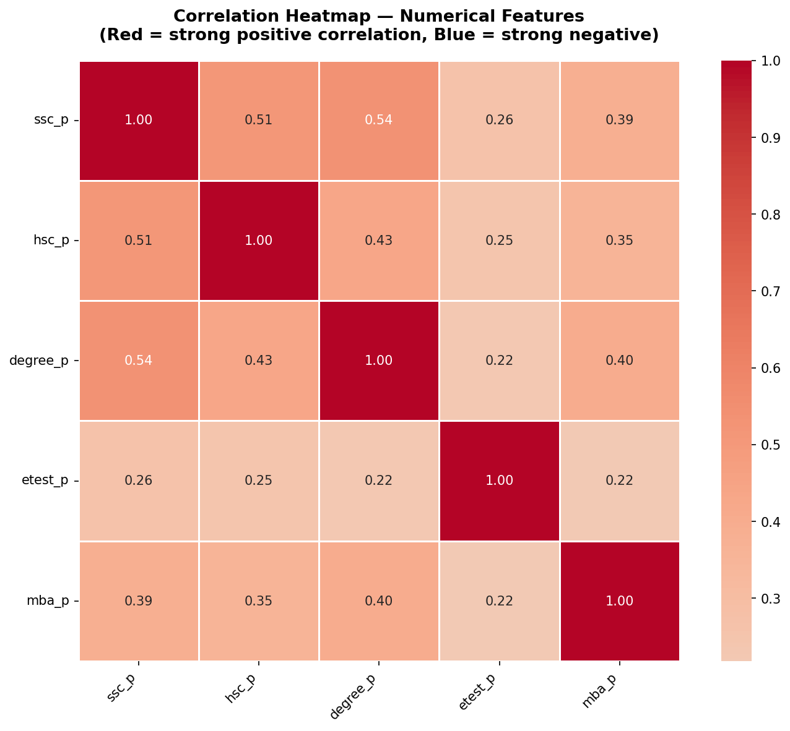
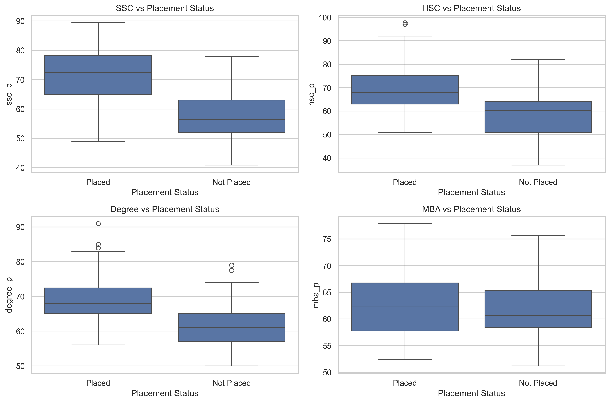
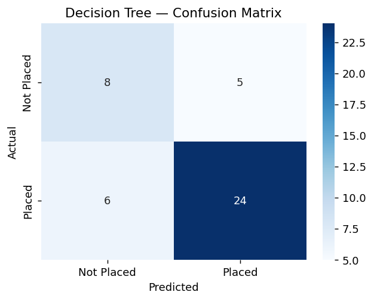
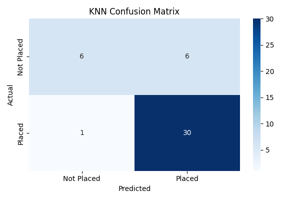
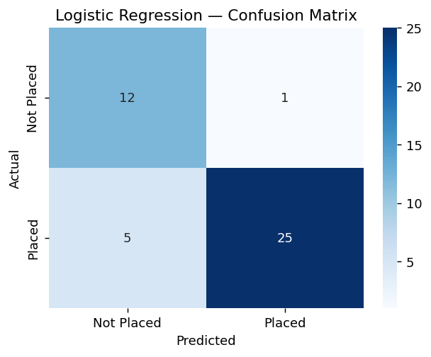
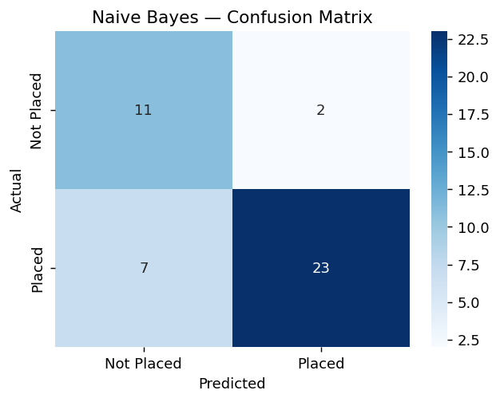
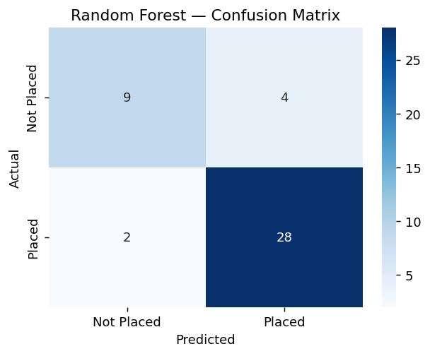
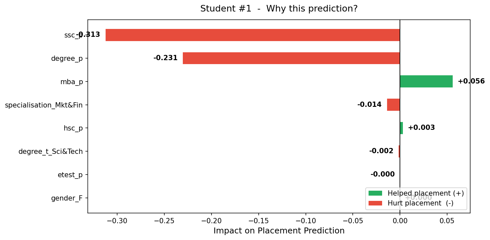
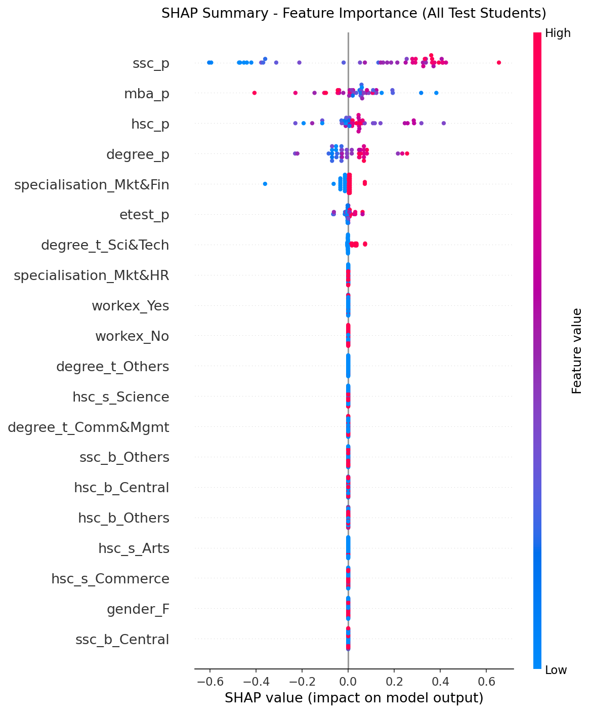
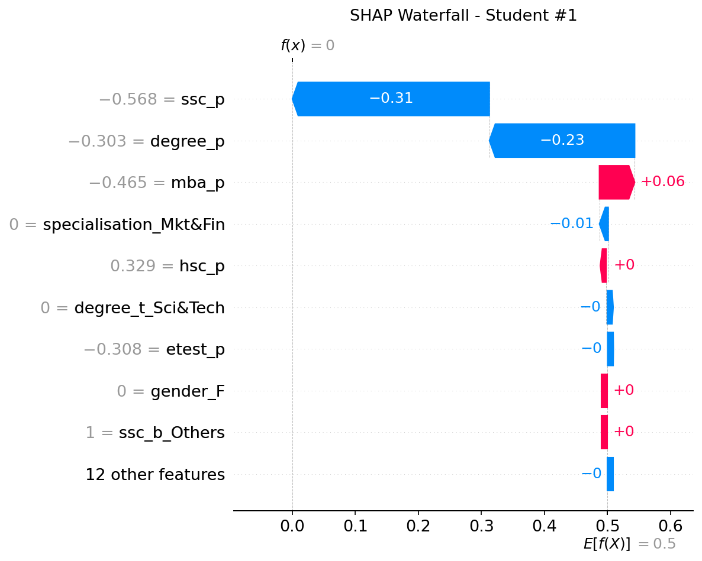

# PlacePredictor

PlacePredictor is a Streamlit-based student placement prediction system. It predicts whether a student is likely to be **Placed** or **Not Placed** using a trained machine learning pipeline. 

The goal of this project is to predict whether a student is likely to be placed or not based on academic, personal, and employability-related information.

## 📸 Screenshots


*PlacePredictor Application Banner*


*PlacePredictor Logo*

### Exploratory Data Analysis & Model Evaluation


*Correlation Heatmap of Dataset Features*


*Decision Tree Boxplots*


*Decision Tree Confusion Matrix*


*K-Nearest Neighbors Confusion Matrix*


*Logistic Regression Confusion Matrix*


*Naive Bayes Confusion Matrix*


*Random Forest Confusion Matrix*

### Explainability


*SHAP Simple Feature Importance*


*SHAP Summary Plot*


*SHAP Waterfall Plot for Single Prediction*

## Features

**What You Are Building:**
PlacePredictor is a **Streamlit web application** powered by a trained machine learning pipeline. A student fills in their academic and personal details through a form, and the system outputs:

- A **placement probability score** (e.g., 82% chance of placement)
- A **SHAP-based explanation** showing which factors helped or hurt the prediction
- **Actionable feedback** such as "Lack of Work Experience is your biggest penalty"

**The app also shows:**
- Placement prediction: Placed / Not Placed
- Placement probability score
- AI-style explanation for why the student is predicted as Placed or Not Placed
- Skill suggestions needed to improve placement chance
- Examiner dashboard with a full model comparison table and exploratory data analysis (EDA) charts.

If the student is predicted as Not Placed, the system explains possible weak factors such as no work experience, low employability test score, low degree percentage, low SSC/HSC percentage, or low MBA percentage. It also suggests skills needed to improve placement chances, including internship experience, aptitude improvement, communication skills, interview preparation, CV building, and project work.

If the student is predicted as Placed, the system explains the positive factors that supported the prediction and provides further improvement suggestions for better career preparation.

## Problem Statement

Student placement depends on multiple factors such as academic performance, work experience, employability test score, specialization, and other background information. This project aims to build a machine learning system that can analyze these features and predict placement status.

## Project Objectives

- Predict student placement status using machine learning.
- Train and compare multiple classification models.
- Evaluate models using proper performance metrics.
- Select the best-performing model based on evaluation results.
- Provide explainable and useful prediction output.

## Dataset

The project uses the student placement dataset containing student academic records, background details, employability test scores, MBA percentage, placement status, and salary information.

The target variable is:
- `status`: Placed or Not Placed

Important preprocessing decisions and notes:
- `sl_no` is only an ID column and should not be used for model training (removed).
- `salary` is a post-placement value and is only available after placement. It should be removed to prevent data leakage.

## Project Workflow

PlacePredictor is a machine learning-based student placement prediction system. The application takes student academic, personal, and employability-related information as input through a Streamlit web interface. After prediction, it displays the placement result, placement probability, and an AI-based explanation.

The project also includes an examiner dashboard that shows model performance, model comparison results, and exploratory data analysis charts.

## Machine Learning Models

**Naive Bayes** is the final selected model for this project.

This project uses six machine learning classification models. The training script compares these six independent classification models so that their performance can be compared and the most suitable model can be selected. All models are trained independently using the same preprocessing and evaluation approach.

### 1. Logistic Regression
Logistic Regression is used as a simple and reliable baseline classification model. It works well when the relationship between input features and the target class is mostly linear. It is also easy to interpret, which makes it useful for understanding how features affect placement prediction.

### 2. Decision Tree
Decision Tree is used because it can learn rule-based decisions from the dataset. It splits the data based on feature values and creates a tree-like structure for prediction. This model is easy to explain because its decisions can be understood using simple conditions such as academic scores, work experience, and specialization.

### 3. Random Forest
Random Forest is used because it combines multiple Decision Trees to produce a stronger and more stable prediction. It reduces the risk of overfitting that can happen with a single Decision Tree. It is useful for improving prediction accuracy and handling complex relationships between features.

### 4. Support Vector Machine
Support Vector Machine is used because it can find a strong decision boundary between placed and not placed students. It performs well on classification problems, especially when the feature space has clear separation after preprocessing and scaling.

### 5. K-Nearest Neighbors
K-Nearest Neighbors is used because it predicts a student's placement status by comparing that student with similar students in the dataset. It is simple and useful for checking whether students with similar academic and background profiles have similar placement outcomes.

### 6. Naive Bayes
Naive Bayes is used because it is fast, simple, and works well as a probabilistic classification model. It provides another comparison point against more complex models and can perform well even with smaller datasets.

## Why These Models

Using multiple models helps us compare different machine learning approaches. Some models are simple and interpretable, while others may perform better on complex patterns. By evaluating all models using the same dataset and metrics, the project can select the most suitable model instead of depending on only one algorithm.

## Data Preprocessing

The preprocessing stage includes:
- Removing unnecessary columns.
- Preventing data leakage.
- Encoding categorical features.
- Scaling numerical features.
- Handling class imbalance using SMOTE.

## Model Evaluation

The models will be evaluated using:
- Accuracy
- Precision
- Recall
- F1-Score

F1-Score is especially important because the dataset has class imbalance between placed and not placed students.

## Explainability

The project will include explainability features so that users can understand why a prediction was made. This may include prediction probability, SHAP-based explanation, and actionable feedback based on important features.

## Visualizations

The project will include visualizations to better understand the dataset and model behavior, such as:
- Correlation heatmap
- Placement rate by category
- Score distribution boxplots

## Tech Stack

Python, Streamlit, scikit-learn, imbalanced-learn, SHAP, pandas, matplotlib, seaborn

## Dependencies

Major dependencies:
- pandas
- numpy
- scikit-learn
- imbalanced-learn
- streamlit
- matplotlib
- seaborn
- joblib

## Project Structure

```text
place-predictor/
│
├── assets/
│   ├── banner.png
│   └── logo.png
│
├── charts/
│   ├── correlation_heatmap.png
│   ├── decision_tree_boxplots.png
│   ├── decision_tree_confusion_matrix.png
│   ├── knn_confusion_matrix.png
│   ├── logistic_regression_confusion_matrix.png
│   ├── naive_bayes_confusion_matrix.png
│   ├── random_forest_confusion_matrix.png
│   ├── shap_simple.png
│   ├── shap_summary.png
│   └── shap_waterfall.png
│
├── data/
│   └── raw/
│       └── Placement_Data_Full_Class.csv
│
├── models/
│   ├── decision_tree_model.pkl
│   ├── logistic_regression_pipeline.pkl
│   ├── logistic_regression_results.csv
│   ├── placement_model.pkl
│   ├── random_forest_model.pkl
│   └── svm_tuned.joblib
│
├── notebooks/
│   ├── 01_eda_and_modeling.ipynb
│   ├── Random_forest.ipynb
│   ├── champion_model_selection.ipynb
│   ├── knn_model_0112330424.ipynb
│   └── shap_analysis.py
│
├── project-files/
│   ├── FINAL_DEFINITIVE_BLUEPRINT.md
│   ├── HOW_TO_RUN.md
│   ├── PROJECT_STRUCTURE.md
│   └── TEAM_WORK_DIVISION.md
│
├── src/
│   └── app.py
│
├── .gitignore
├── README.md
└── requirements.txt
```

## Installation & How to Run

Install dependencies:

```bash
pip install -r requirements.txt
```

Run Streamlit app:

```bash
streamlit run src/app.py
```

*Note: This README will be updated as the project develops.*
